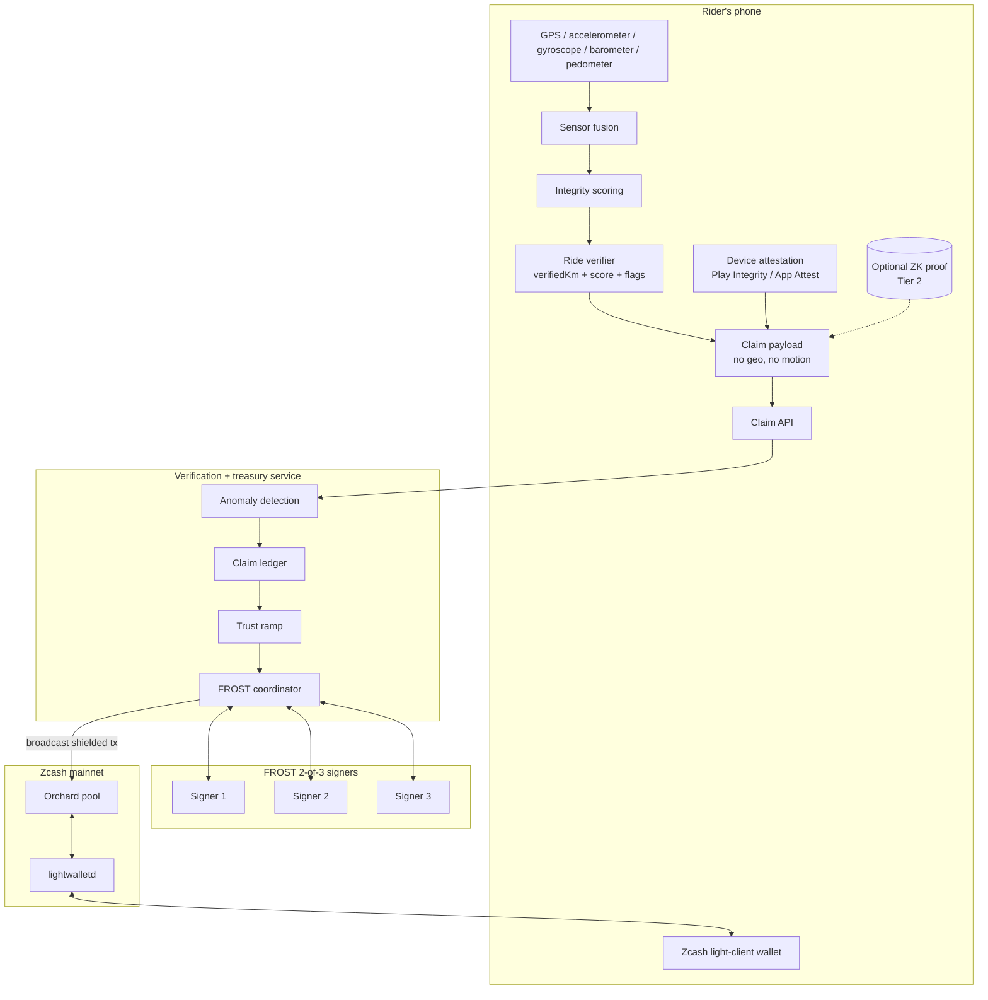

# Pedalshield - Architecture

This document captures the system design as of Phase 2. It will be updated as components land.

## Goals

1. **Privacy by default** - a rider's route, identity, and exact distances never leave the device in identifiable form.
2. **Real shielded mainnet payouts** - rewards land in the rider's shielded Zcash address via Orchard transactions, signed by a FROST threshold treasury.
3. **Layered anti-cheat** - no single mechanism is asked to do more than its threat model allows.
4. **Joyful, fair game loop** - effort always dominates the payout formula; bike upgrades are a bounded accelerant.

## System diagram



## Data flow - ride to shielded payout

1. **Capture** - rider taps *Start Ride*. The app collects GPS, accelerometer, gyroscope, barometer, and pedometer samples at full rate. All raw data is held in memory only.
2. **Verify on-device** - at *Stop Ride*, `extractFeatures()` runs sensor fusion and `scoreRide()` produces an `integrityScore` and a list of `VerificationFlag`s. Hard fails (teleport, missing motion data, speeds outside cycling envelope) zero the score immediately.
3. **Build claim** - `toClaimPayload()` strips everything but `{ rideId, startedAt, endedAt, verifiedKm, integrityScore, status, flags, attestation }`. A privacy unit test in the suite enforces this with code.
4. **Submit** - the claim is POSTed to the Pedalshield backend with the device attestation token.
5. **Server checks** - the backend re-validates attestation against Play Integrity / App Attest, runs cross-ride anomaly detection (impossible weekly volume, duplicate traces, velocity outliers), applies the rider's trust multiplier, and writes the claim to the ledger.
6. **Batched payout** - claims accumulate. On a schedule (or at rider request), the FROST coordinator builds one Orchard shielded transaction that pays N riders at once. Batching breaks payout-timing correlation, mirroring the privacy property shielded transactions provide for amounts and recipients.
7. **Sign** - the FROST coordinator runs a 2-of-3 signing ceremony per ZIP-312. Signers verify the payout batch against the ledger before signing.
8. **Broadcast** - the signed transaction is sent to `lightwalletd` and lands on Zcash mainnet.
9. **Rider sees ZEC** - the in-app light-client wallet syncs and the Streak Vault balance updates.

## Privacy guarantees

| Data | Where it lives | Who can see it |
|---|---|---|
| Raw GPS trace | RAM on the phone, deleted at end of ride | Only the rider |
| Sensor samples | RAM on the phone, deleted at end of ride | Only the rider |
| Verified distance, score, flags | Claim payload | Backend (pseudonymous account ID) |
| Payout amount | Shielded (Orchard pool) | Only the rider |
| Recipient address | Shielded | Only the rider |

The earning formula uses `verifiedKm` and `integrityScore`, so the server learns *how much* you rode but never *where*. Tier 2 adds a ZK proof so the server doesn't even learn `verifiedKm` directly - only a proof that the canonical verification circuit, run on committed sensor data, produced a distance in some range.

## Anti-cheat - layered, honestly framed

A client-side ZK proof does not, by itself, stop sensor spoofing. It proves a computation ran correctly, not that the inputs were real. Pedalshield uses defence-in-depth:

| Layer | What it catches | What it does not catch |
|---|---|---|
| Sensor fusion + integrity score | GPS-only spoof apps, car rides, walks | Replay of real recorded sensor traces |
| Device attestation (Play Integrity / App Attest) | Emulators, modified app builds, scripted runs | A physical attacker with a real device |
| Server anomaly detection | Impossible weekly volume, duplicate traces, velocity outliers across rides | Slow, patient cheating below detection thresholds |
| Trust ramp | Quick high-volume cheating on new accounts | Long-term reputation farming |
| Economic friction (daily caps, finite treasury) | Industrial-scale extraction | Small individual gains |

The ZK proof in Tier 2 handles *privacy*, not anti-cheat. We say this out loud so judges trust the rest of the design.

## Earning formula

```
ZEC per ride = base_rate * verified_km * integrity_score * trust * streak * upgrade
```

- `verified_km` - the only linear, uncapped term. Effort dominates.
- `integrity_score` - 0..1, multiplicative. Hard-fail rides earn nothing.
- `trust` - 0.25 -> 1.0, grows with consistent honest riding.
- `streak` - 1.0 -> 1.5, daily streak multiplier.
- `upgrade` - 1.0 -> 1.15 maximum, steeply diminishing tiers. ZEC upgrades cannot out-earn pedaling.

## Treasury

The community pool is a FROST 2-of-3 shielded account. Upgrade purchases are shielded payments from rider -> treasury, recycling ZEC back into the reward pool. The treasury is finite; sustainability comes from this recycling sink, not from token emission.
